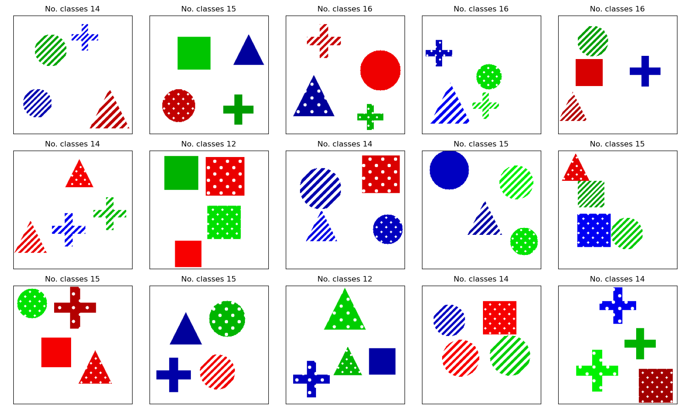

# Elements
A configurable synthetic dataset of simple shapes with ground truth concepts and known causal relationships between concepts and classes.

First released as part of Explaining Explainability: Understanding Concept Activation Vectors by Nicolson et al. https://arxiv.org/abs/2404.03713.

colors.py, shapes.py and textures.py each contain the basic code for creating the concepts. If you wish, there is no reason you could not add more concepts here.

classes.py contains most of the code. Here are the important classes for this repository:
- Element is an object in an image, with associated concepts
- ElementImage contains multiple Elements and is an individual image. It contains the code to actually place each element on a canvas to create the image
- ElementDataset is the base dataset class used for model training. It is used to configure the combinations of concepts that are allowed to be created in each image
- GroupedElementDataset is used to extract examples of individual concepts, classes or just random images. Very useful for creating probe datasets

See visualise_dataset_example.ipynb for examples of how to create a dataset.

